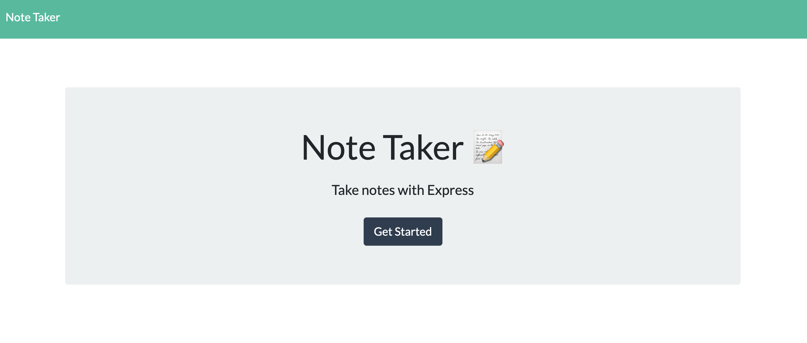
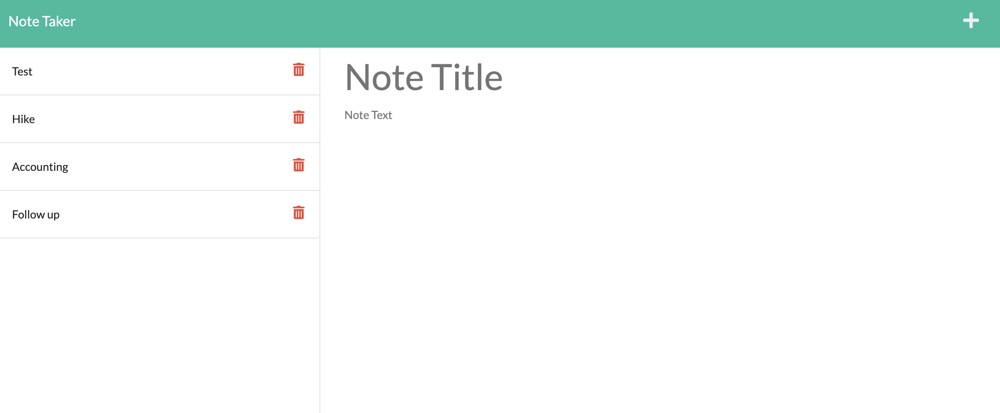

# no-faking-note-taking

## Description

No Faking Note Taking is an application that can be used to write and save notes. This application will use an Express.js back end and will save and retrieve note data from a JSON file.

## Table of Contents

- [Installation](#installation)
- [Usage](#usage
- [Technology](#technology)
- [Credits](#credits)
- [License](#license)

## Installation

If you are a contributor please run npm i to install all dependencies.

## Usage

- When the user opens the app they are presented with a landing page with a button link to a notes page
- Click the link to the notes page is clicked, the user is presented with a page with existing notes listed in the left-hand column, plus empty fields to enter a new note title and the note’s text in the right-hand column
- When you enter a new note title AND the note’s text, a Save icon appears in the navigation at the top of the page
- When user clicks on the Save icon, the new note entered is saved and appears in the left-hand column with the other existing notes
- When user clicks on an existing note in the list in the left-hand column, that note appears in the right-hand column
- When user click on the plus icon in the navigation at the top of the page they are presented with empty fields to enter a new note title and the note’s text in the right-hand column

[Deployed Heroku Link](https://no-faking-note-taking.herokuapp.com/)

## Technology

JavaScript
Express.js
HTML
CSS

## Credits

The starter code was provided by The Coding Boot Camp | UC San Diego Extension | Trilogy Education Services, LLC
